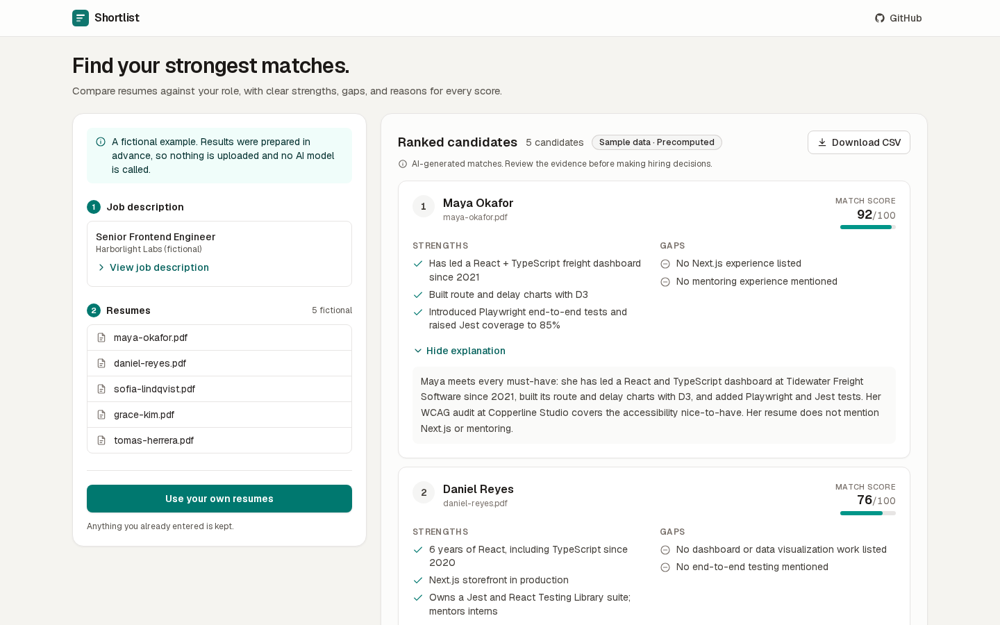

# Shortlist

Paste a job description, add a stack of PDF or Word resumes, and get a ranked shortlist with a one-line reason, strengths, and gaps for each candidate.

> Scores are a screening aid, not a hiring decision. A person should review every candidate.

**Live demo:** https://shortlist-yavuz.vercel.app

Shortlist is a portfolio project. It is aimed at a recruiter or hiring manager at a small company with no applicant tracking system. See [the product brief](docs/Shortlist-Product-Brief.md) for the full scope.



Click **Try with sample data** for an instant, free demo. It shows a fictional job, five fictional resumes, and precomputed results, and makes no AI calls.

## Status

| Ticket | Scope | Status |
| --- | --- | --- |
| Milestone 1 | Skeleton and first deployment | Done |
| SHORT-01 | Job description input (10,000-character limit, live count, 100-character minimum) | Done |
| SHORT-02 | PDF upload: drag and drop or file picker, 1–50 files, 5 MB each, text extracted in the browser | Done (limit raised from 20 to 50; DOCX added) |
| SHORT-03 | Live ranking and streaming | **Done and live in production**, verified on a protected preview and on production (see Verification). Known limits are listed below. |
| SHORT-04 | Try it instantly: fictional job + 5 fictional resumes | Done. Precomputed, labeled as such, zero AI calls; uses the same table, explanations, and CSV export as live results |
| SHORT-05 | CSV export | Done. Browser-side; same columns as the table, in rank order; failed resumes listed after with no score; PDFs with images get " [Text-only extraction]" after the candidate name |
| SHORT-06 | Expandable explanations | Done. "Why this score?" on every successful row, desktop and mobile, keyboard accessible; no extra requests |
| SHORT-07 | Pasted resume text | Done. "Paste text" next to file upload; one shared list (50 total, 30,000 characters each); PDFs with images get a notice and a "Text-only extraction" mark on their result |
| Agency trial | 50 resumes, DOCX, one-line reason, "Export top 10" | Done. Verified with mocked scoring and with the live model on a local production server (see Verification). Details below |

### Agency trial additions

- **50 resumes per run** (was 20), enforced in the browser and by the server schema. Files are still read one at a time in the browser; scoring is still 5 at a time. Each file and each resume succeeds or fails on its own. Unreadable files are named in one summary with a "Remove these files" button.
- **DOCX upload** next to PDF and pasted text, read in the browser, 5 MB per file. Text in the page header (often the name and contact line) is included; text inside images is not (no OCR). DOCX files with images get the same "Text-only extraction" notice as PDFs.
- **One-line reason** beside each candidate. It is a `reason` field in the same structured model response (no extra call; about 30 more output tokens), held to the same evidence and fairness rules as strengths and gaps. Strengths, gaps, and "Why this score?" are unchanged. The sample results have hand-written reasons.
- **Export top 10**: Rank, Candidate, Score, Reason for the best 10 scored candidates in displayed order (fewer if fewer were scored; failed resumes are left out). Same quoting, BOM, formula guard, and " [Text-only extraction]" mark as the full export. "Download CSV" is unchanged.

**Production has live ranking on**, limited to 3 runs per network per UTC day and backed by the $5 monthly spend limit on the Anthropic workspace.

**Privacy.** PDF and DOCX files stay in the browser: text is extracted there (`pdfjs-dist` for PDFs, a built-in ZIP/XML reader for DOCX). Clicking Rank does send resume information off the device: the extracted text and file names go to `/api/rank`, which sends each resume's text to Anthropic for scoring. Shortlist stores none of it after the request and doesn't log it. Anthropic's own data retention applies to what it receives. Logs hold only counts, codes, timings, and token usage; Redis holds only a hashed IP counter per day. Sample mode and CSV export send nothing.

**Sample results** in `src/data/sample.ts` were written by hand to match the scoring rules and are labeled as precomputed. Replacing them with model output later is optional.

### How live ranking works

1. The browser sends `{ jobDescription, resumes: [{ id, fileName, text }] }`.
2. The server checks, in order: `ENABLE_REAL_RUNS`, provider config, rate limiter config, content type, body size (while reading), JSON, and Zod validation.
3. It uses up one of the caller's 3 daily runs. A blocked run gets `429` and no model call is made.
4. It scores up to 5 resumes at a time with Claude Haiku 5.5 and streams each result (or a file-specific error) as one NDJSON line as soon as it finishes. No new call starts after 240 s; any resume not started by then is reported as not scored ("time limit"). The route's `maxDuration` is 300 s. A typical 50-resume run takes about a minute.
5. The browser inserts each row and re-sorts by score. Ties keep upload order, so ranks are stable.

### Scoring model and cost controls

| Setting | Value | Why |
| --- | --- | --- |
| Provider / model | Anthropic, `claude-haiku-5-5` | $0.10 / MTok input, $0.50 / MTok output (prompts up to 100K tokens), with structured JSON output |
| Output format | `output_config.format` JSON schema, then the Zod schema | The API constrains the shape; Zod enforces 3 strengths, 2 gaps, integer 0–100, 2–3 sentences |
| Temperature | Not sent | Claude Haiku 5.5 rejects any non-default temperature with a 400. Structured output and `effort: "low"` keep scores consistent instead. |
| Input-token ceiling | 50,000 per resume, counted before each call (free count endpoint, no model run, 10 s timeout) | Characters don't bound tokens (see below). Over the ceiling, only that resume fails ("too long"); nothing is billed for it |
| `max_tokens` | 2,000 per resume | Bounds output cost and covers the model's thinking plus the JSON |
| Timeout | 30 s per call | Bounds call duration |
| SDK retries | 0 (SDK default is 2) | A failed call becomes a failed row, so billed calls can never exceed resumes |
| Concurrency | 5 per run | Brief |
| Run-wide stop | HTTP 400/401/402/403/404/429 from the provider | Covers spend limits (400), the tier spend cap and rate limits (429), billing (402), and key problems. No more calls are scheduled, in-flight calls are cancelled, and the rest are reported as not scored. |
| Cancellation | Browser cancel or disconnect aborts in-flight calls and stops scheduling | |

Character limits don't bound tokens. Measured with the count endpoint for a 10,000-character job plus a 30,000-character resume: English prose 14.6K input tokens, CJK 44K, emoji 57K, rare symbols 91K, and text made of `&` or `<` (escaped as `&amp;`/`&lt;`) 162K. Claude Haiku 5.5 bills prompts over 100K tokens at $0.50 in / $2.50 out per MTok, so without a ceiling one such resume costs about $0.086 and a 50-resume run about $4.30. The 50,000-token ceiling keeps every call under the 100K price threshold.

**Enforced worst case:** at most one scoring call per resume (no retries), each at most 50,000 input + 2,000 output tokens = $0.006. Per run (50 resumes): **$0.30**. Per network per day (3 runs): **$0.90**. Count estimates may differ slightly from billed input; the ceiling is half the price threshold, so that can't change the price tier. **Typical** (live 50-resume run, 2026-10-09): about 1,900 input and 800 output tokens per resume, about $0.0006 per resume and **$0.03 per 50-resume run**. The hard backstop is the **$5 monthly spend limit** on the "Shortlist" Anthropic workspace that owns the API key; when it is reached the API returns 400 and the run stops.

### Rate limit policy

- 3 real ranking runs per IP per **UTC calendar day**: a fixed window that resets at 00:00 UTC, not a rolling 24 hours.
- Counted once per valid run, after validation and before any model call. Invalid requests and sample mode never count.
- The IP comes from `x-vercel-forwarded-for`, which Vercel sets and doesn't let clients spoof. Client-supplied `x-forwarded-for` / `x-real-ip` are ignored. Off Vercel, every request shares one bucket.
- Upstash `@upstash/ratelimit` fixed window: one atomic Lua script per check, so simultaneous requests can't share the last run.
- Redis stores only `shortlist:rank:<env>:<sha256(ip)>:<day> → count`, which expires with the window.
- Fails closed. Missing Redis config, a Redis error, or a 3-second timeout all mean `503`, never an unmetered run. The library's own fail-open timeout is turned off.

### Verification (2026-10-07 to 10-08 UTC, fictional data only)

| Check | Where | Result |
| --- | --- | --- |
| 4 simultaneous one-resume runs from one IP | Protected preview, `vercel curl` | 3 streamed results, 4th got `429`; exactly 3 model calls in the logs |
| 4-resume run: Maya ×3 (same file name, distinct ids) + a variant missing automated testing | Protected preview, real browser through a local proxy that forwards via `vercel curl` | One POST; rows appeared one at a time (6.4 s, 6.6 s, 6.9 s, 7.3 s) and re-sorted as they arrived |
| Experience durations | same run | All three Maya results: "React work documented since 2019", "about 5 years of TypeScript (2021–present)". Scores 88, 88, 85. Variant: 55, "Automated testing … is not evidenced in the resume, and it is a must-have requirement" |
| One-resume run | Production, real browser, no proxy | One POST, result in about 6.1 s, score 88. Sample mode made 0 API requests. No console errors |
| Limiter namespaces | Redis | `shortlist:rank:preview:…` and `shortlist:rank:production:…` are separate keys |
| Maya + Jordan run, stream captured in the page | Production, real browser, no proxy | Rows arrived separately (5.1 s, 5.6 s). Maya 85: "the dated Tidewater role (2021-present) supports about 5 years of React and TypeScript". Jordan 55: automated testing "is not evidenced in the resume, which caps the score at 60 or lower". Both explanations are 2 sentences citing resume specifics. CSV export matched the table; expanding and exporting made no requests |
| Explanations, CSV edge cases, export gating, loading/partial/error states, keyboard, mobile | Mocked `/api/rank` in the browser (no server calls), local and production | 21/21 checks pass |
| Log content | Vercel logs | No resume, job, or company text in any log line |
| Agency trial: sample flow, 50 mixed resumes (25 PDF, 25 DOCX), 8 bad files, 51st-file limit, rank display, both CSVs, body-size pre-check | Local dev server, real browser, `/api/rank` mocked in the browser (2026-10-09, no model calls) | 45/45 checks pass. Every extracted text contained its fictional candidate's name (including a header-only DOCX); 50-resume body 18 KB; bad files each named with a reason while the other 40 read normally; top-10 CSV matched the displayed names, scores, and reasons |

| Agency trial, live: 5-resume smoke test (3 DOCX, 2 PDF) | Local `next start` with the real key and the dev Redis limiter, real browser, nothing intercepted (2026-10-09) | 5/5 scored, rows arrived at 5.8–6.5 s, every result had a `reason` (14–21 words), structured output valid, both CSVs matched the display |
| Agency trial, live: 50 resumes (25 PDF, 25 DOCX, all made by Microsoft Word 16) | same | 50/50 scored, 0 failed, 49.3 s; rows streamed in at 47 distinct times; 93,768 input / 40,496 output tokens (max 1,966 input per call), about $0.030. Display order, top-10 CSV (10 rows), and full CSV (50 rows) all matched the stream. Every year, metric, employer, and technology in all 50 reasons appears in that resume or the job; candidates missing a must-have scored ≤ 60 |
| DOCX reader on real Word files | Node, real extractor, 25 Word 16 DOCX files | 25/25 exact: header-only names found, text boxes once (fallback copy skipped), tracked deletions excluded, hyperlink text kept and URL dropped, tables, bullets, smart quotes, `&`, `<`; images flagged in all 9 files that have them |
| Vercel duration | Project settings via the Vercel API | Hobby plan, Fluid compute on, default and maximum function duration 300 s; matches `maxDuration = 300`. Worst case in code: 240 s deadline + 10 s count + 30 s call = 280 s |
| Agency trial, live: neutral-reference prompt, 5 resumes incl. the one that got "her" | same as the smoke test | 5/5 scored in 6.3 s; 0 of 35 generated fields with a gendered pronoun or the candidate's first name; both CSVs matched; 9,761 input / 3,605 output tokens, about $0.003 |
| Anthropic workspace spend limit ($5) | Anthropic Console, by the owner (2026-10-09) | Confirmed: the production workspace has the $5 monthly limit. Not readable with a regular API key (the Admin API refused one) |
| Anthropic rate limits | Response headers on a live call | 10,000 requests, 10M input tokens, 2M output tokens per minute for Claude Haiku 5.5. A 50-resume run uses about 50 requests and 100K input tokens per minute |

Cost to date: 10 model calls, 16,620 input and 6,544 output tokens, about **$0.005** (budget: $0.50 for initial testing, $5 monthly cap). Agency trial verification (2026-10-09): 61 model calls (one 15-token probe, 5 smoke, 50 full, 5 pronoun rerun), 112,968 input and 48,166 output tokens, about **$0.036** (budget: $1).

### Known limitations

- **Scores vary between identical runs.** Observed: the same fictional resume scored 85, 88, and 88 in one run, and 85 and 88 across runs. Claude Haiku 5.5 doesn't accept a `temperature` setting, but even where temperature can be set, it wouldn't guarantee identical scores. Treat differences of a few points as noise.
- **Durations can be incomplete.** In testing, explanations stated dated experience correctly but sometimes mentioned only the most recent role (for example, Maya's React work since 2019 wasn't always mentioned).
- **No OCR.** Scanned or image-only PDFs are rejected with an error. Some PDFs mix real text with lines stored as images (for example, a skills section exported as a picture). Shortlist reads the text but not the images. Such files say "This PDF contains images. Any text inside them won't be included in scoring," and their results carry a "Text-only extraction" mark. In the CSV, their Candidate cell ends with " [Text-only extraction]". Paste the full resume text instead when that matters.
- **An unresolved scoring failure.** One production run (2026-10-08) rejected a model response with "The scoring response didn't match the expected format." The failing field wasn't logged at the time and the case didn't reproduce. Validation failures now log the field and rule (no content), so the next occurrence can be diagnosed.
- **Any 429 stops the run.** There are no retries: a rate-limit 429 (with `retry-after`) or the tier spend-cap 429 (without) stops scheduling, and the rest are listed as not scored. The organization's limits are about 200× what a 50-resume run needs, so this should only happen on a spend cap or a sudden-traffic ("acceleration") limit.
- **Pronouns.** In the first live 50-resume run, 1 of 385 generated fields (a reason) called a candidate "her", inferred from the name. The prompt now requires "the candidate" or singular "they" in every generated field and forbids inferring gender or pronouns from names; a 5-resume live rerun (including that candidate) had 0 of 35 fields with a gendered pronoun or first name. Five resumes can't prove it never happens, so keep an eye on it in review.
- **Demo limits.** 3 live rankings per network per UTC day. Networks that share an IP (offices, mobile carriers) share the allowance.
- **The spend limit** was set and confirmed in the Anthropic Console by the owner at launch. The owner reconfirmed it in the Console on 2026-10-09 before the agency trial. It isn't readable with a regular API key (the Admin API refused one) and wasn't tested by exhausting it.
- **Screening aid only.** The model can be wrong; every candidate needs human review.

## Limits

| Limit | Value | Where |
| --- | --- | --- |
| Job description | 100–10,000 characters (UTF-16 code units, JavaScript `.length`) | Browser and server |
| Resumes per request | 1–50 | Browser and server |
| File types | PDF and Word `.docx`. `.doc`, other types, password-protected, empty, and image-only files get a named error. No OCR. | Browser |
| File size (PDF or DOCX) | 5 MB = 5,242,880 bytes. Exactly 5,242,880 is accepted; 5,242,881 is rejected. | Browser |
| Extracted text per resume | 1–30,000 characters, after trimming whitespace for the empty check. Over the limit is an error, not truncated. | Browser and server |
| Input tokens per resume | 50,000, counted by the provider before scoring (job, file name, resume, and instructions together). Over the limit, that resume fails with "too long"; the others continue. | Server |
| File name | 1–255 characters, no control characters | Server |
| Resume id | 1–64 characters: letters, digits, `-`, `_`; unique per request | Server |
| Request body | 4,000,000 bytes, counted while reading; larger bodies get `413`. The browser measures the exact body first and explains instead of sending. | Browser and server |

4,000,000 bytes stays below Vercel's 4.5 MB request limit. 50 maximum-length resumes (30,000 characters each) fit when the text is ASCII (about 1.5 MB) or 2-byte UTF-8 such as accented Latin, Cyrillic, Greek, Arabic, or Hebrew (about 3.1 MB). Only very long 3-byte text (for example, CJK) can exceed it: 50 × 30,000 such characters is about 4.5 MB. Then the browser says how large the batch is and asks to remove some resumes or split the batch; no run is used. Real resumes are far smaller (50 fictional test resumes: 18 KB).

## API

`POST /api/rank` with `Content-Type: application/json`:

```json
{
  "jobDescription": "string, 100–10,000 characters",
  "resumes": [{ "id": "r1", "fileName": "jane.pdf", "text": "extracted resume text" }]
}
```

Error responses are JSON: `503` (`live_ranking_disabled`, `scoring_not_configured`, `rate_limit_unavailable`), `415`, `413` (`body_too_large`), `400` (`invalid_json`, `invalid_encoding`, `invalid_request` with issue paths), `429` (`rate_limited`, with `Retry-After`).

A successful run is `200` with `Content-Type: application/x-ndjson`, one event per line, in finishing order:

```json
{"type":"start","total":2,"runsLeftToday":2,"resetsAt":1791504000000}
{"type":"result","outcome":{"id":"r2","fileName":"x.pdf","ok":false,"error":{"code":"timeout","message":"Scoring timed out."}}}
{"type":"result","outcome":{"id":"r1","fileName":"jane.pdf","ok":true,"result":{"candidateName":"Jane","score":82,"reason":"…","strengths":["…","…","…"],"gaps":["…","…"],"explanation":"…"}}}
{"type":"done","scored":1,"failed":1}
```

A `{"type":"stopped","reason":"provider_rejected"}` line appears before `done` when the provider stopped accepting requests.

## Stack

| Layer | Choice |
| --- | --- |
| Front end | Next.js (App Router), React, TypeScript, Tailwind CSS |
| Text extraction | PDF: `pdfjs-dist`. DOCX: built-in ZIP reader (`DecompressionStream`) and WordprocessingML text runs, no dependency. Both in the browser; raw files never leave it. |
| API | Next.js route handler (Node.js runtime) |
| Validation | Zod, for requests and model output |
| Tests | Vitest |
| Hosting | Vercel |
| LLM | Anthropic `@anthropic-ai/sdk`, `claude-haiku-5-5`, structured JSON output |
| Rate limiting | Upstash Redis (Vercel Marketplace, free tier) with `@upstash/ratelimit`: 3 real runs per IP per UTC day. Counters only. |

## Project layout

```
src/app/layout.tsx              Root layout: fonts, page title, description
src/app/page.tsx                The single page: pitch, sample demo, "rank your own resumes" form
src/app/api/rank/route.ts       POST /api/rank: wires the handler to the real gate, provider, limiter, and logger
src/app/icon.svg                Favicon
src/app/globals.css             Tailwind import and base colors
src/components/workspace.tsx    The workspace: mode switch (your resumes / sample), inputs left, results right
src/components/live-inputs.tsx  Your inputs: job description, resumes, checklist, Rank / Cancel, runs left
src/components/sample-inputs.tsx Read-only sample inputs (collapsed job description, 5 fictional files)
src/components/results-panel.tsx Ranked candidates: header, badge, CSV, AI notice, empty/live/error states
src/components/candidate-list.tsx Candidate cards: rank, match score, strengths, gaps, "Why this score?"
src/components/job-description-input.tsx  Text box with character count and limits
src/components/resume-upload.tsx          Drop zone, file picker, file list with statuses and Remove
src/components/step-title.tsx   Numbered step headings
src/components/export-button.tsx CSV download button ("Export top 10" and "Download CSV", sample and live)
src/components/icons.tsx        Small inline SVG icons
src/lib/limits.ts               Every input limit, shared by browser and server
src/lib/check-resume-file.ts    Type and size check for a picked or dropped file
src/lib/use-resume-files.ts     File list state, one-at-a-time parsing queue, removal
src/lib/extract-pdf-text.ts     Browser-side PDF text extraction and error classification
src/lib/extract-docx-text.ts    Browser-side DOCX text extraction (ZIP + XML, zip-bomb bounded) and errors
src/lib/ranking/schema.ts       Zod schemas: request, model output, result
src/lib/ranking/prompt.ts       System prompt and user prompt builder
src/lib/ranking/score.ts        Scorer boundary, typed scoring errors, per-resume validation, name fallback
src/lib/ranking/run.ts          Runs up to 5 scoring calls at a time; stops on cancel, provider rejection, or the 240 s deadline
src/lib/ranking/anthropic-scorer.ts  Claude Haiku 5.5 adapter: bounded tokens, timeout, no retries, error mapping
src/lib/ranking/rate-limit.ts   Upstash fixed-window limiter (fails closed) and trusted client identity
src/lib/ranking/rank-rows.ts    Sorts live results and assigns ranks
src/lib/ranking/events.ts       NDJSON stream event types shared by server and browser
src/lib/ranking/log.ts          Metadata-only logger
src/lib/ranking/read-body.ts    Reads the request body with a byte limit
src/lib/ranking/handler.ts      The route logic: gate, limits, validation, rate limit, streamed scoring
src/lib/ranking/provider.ts     ENABLE_REAL_RUNS gate, provider config, and the one boolean the page shows
src/lib/use-live-ranking.ts     Browser: sends a run, reads the stream, cancel, one run at a time
src/lib/csv.ts                  Builds both CSVs (full, top 10): quoting, BOM, formula-injection guard, rank order
src/lib/**/*.test.ts            Vitest tests
src/data/sample.ts              Fictional job, five resume fixtures, precomputed results
```

## Run locally

Requires Node.js 20.9 or later.

```bash
npm install
npm run dev
```

Open http://localhost:3000. No API keys or Redis credentials are needed. The sample experience works out of the box.

Checks:

```bash
npm test
npm run lint
npm run typecheck
npm run build
```

## Environment variables

See [.env.example](.env.example). All are server-only.

| Variable | Default | Purpose |
| --- | --- | --- |
| `ENABLE_REAL_RUNS` | unset (off) | Real runs are allowed only when this is exactly `true`. Keep it off until the spending cap and the deployed rate limit are verified. |
| `SCORING_PROVIDER` | unset | `anthropic` (the only adapter). |
| `SCORING_MODEL` | unset | `claude-haiku-5-5`. |
| `ANTHROPIC_API_KEY` | unset | Key from the "Shortlist" workspace ($5 monthly spend limit). Server only. |
| `KV_REST_API_URL` / `KV_REST_API_TOKEN` | unset | Set by the Upstash integration (`UPSTASH_REDIS_REST_*` also accepted). Without them live ranking refuses every run. |

The page tells the browser only whether live ranking is available (one boolean, computed on the server at build time). Changing env vars requires a redeploy.

## Deploy

Deployed with the Vercel CLI to the Vercel project `shortlist`. Pushing to GitHub does not deploy.

```bash
vercel link --project shortlist
vercel deploy --prod
```

## Privacy and guardrails

- All sample people and companies are fictional.
- PDF and DOCX files never leave the browser. Their extracted text leaves the device only when you click Rank; it is scored by Anthropic and not stored or logged by Shortlist.
- Scores are a screening aid, not a hiring decision.
